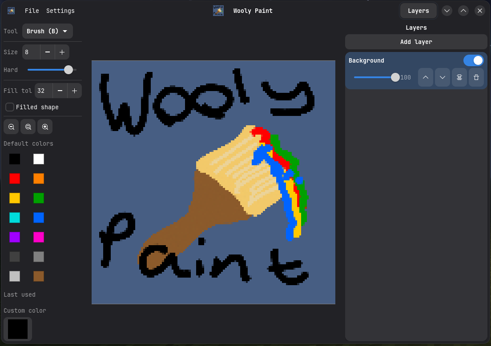

# wooly-paint
this was made entirely with 4.6 and cursor's composer 2 \
(i have not read a single line of code) \
this is also completely untested on anything but arch


icon made in its own app lmao

# _
everything below here is ai generated, trust it as much as you like
# _

A small raster paint program for the desktop, built with [GTK 4](https://gtk.org/) and [libadwaita](https://gnome.pages.gitlab.gnome.org/libadwaita/). It supports layered documents, common drawing tools, and follows your system light/dark preference.

## Features

- **Layers** with per-layer **opacity**, **visibility**, **blend modes** (Normal, Multiply, Add), compositing, and undo history
- **Tools**: brush, pixel, eraser, eyedropper, flood fill, line, rectangle, ellipse, rectangular select, magic select (same-color regions), **move** (transform floating selections and similar), and hand (pan)
- **Files**: **Open** PNG, JPEG, WebP, GIF, BMP, or [OpenRaster](https://www.openraster.org/) (`.ora`). Raster formats load as a single flattened layer; `.ora` keeps layers. **Save** as PNG (composite) or `.ora` for multi-layer round-trip
- **Palettes**: sidebar with named palettes; import and export hex palette text from the Palette menu
- **Settings**: custom keyboard shortcuts for tools (Keybinds)
- **Updates**: official **Linux x86_64** and **Windows x86_64** release bundles can check GitHub Releases from **Settings → Check for Updates…** (including optional self-update where supported)

## Prebuilt binaries

GitHub Actions builds installable bundles on every run of the **Release build** workflow:

1. Open the **Actions** tab in this repository and select **Release build**.
2. Open the latest run and download the **artifacts** at the bottom (Linux `.tar.gz`, Windows `.zip`).

**Linux (Arch-first):** The tarball is built in an [Arch Linux](https://archlinux.org/) container so the `wooly-paint` binary matches Arch’s glibc and GTK stack. Extract it, install `gtk4` and `libadwaita` from pacman if needed, then run `./wooly-paint`. If pinning to the taskbar shows a blank icon when the app is closed, run `./install-portable-menu.sh` once if the archive includes it; otherwise use the manual commands in `README.txt`. Older release tarballs may not ship the script yet.

**Windows:** Unzip and run `run-wooly-paint.cmd` (it sets `PATH` and GTK data dirs). If something is still missing, use [MSYS2](https://www.msys2.org/) MinGW64 with `gtk4` / `libadwaita` as described in the zip’s `README.txt`.

**Tagged releases:** Pushing a git tag matching `v*` (for example `v1.0.0`) attaches the same files to a [GitHub Release](https://docs.github.com/en/repositories/releasing-projects-on-github/about-releases) automatically. Those builds are what in-app update checks use.

**Package locally** (after `cargo build --release`):

```bash
./scripts/package-linux-release.sh    # Linux tarball under dist/
```

On Windows, from an **MSYS2 MinGW64** shell after a release build:

```bash
bash scripts/package-windows-release.sh
```

## Requirements

- **Rust** toolchain (2021 edition), e.g. via [rustup](https://rustup.rs/)
- **GTK 4** and **libadwaita** development packages

## Build and run

```bash
cargo build --release
./target/release/wooly-paint
```

On non-Windows targets, the build writes `target/<profile>/wooly-paint.desktop` next to the binary so you can launch from a file manager with the correct working directory and icon.

## Optional: user menu entry (Linux)

After building, you can install a Freedesktop application entry and icon under `~/.local/share`:

```bash
./scripts/install-desktop-user.sh
```

Pass a path to the binary if it is not under `target/release/` or `target/debug/`.

## Windows

Release builds for Windows can embed `src/assets/icon.ico` via the `winres` build dependency when built on Windows with a suitable toolchain.

## Credits

**Tool cursors** use icons from [Lucide](https://lucide.dev/) (via the `lucide-static` package), licensed under the [ISC License](https://lucide.dev/license). SVG sources live in `assets/cursors/svg/` and are rasterized at build time; see `assets/cursors/THIRD_PARTY_NOTICES.txt` for details.
